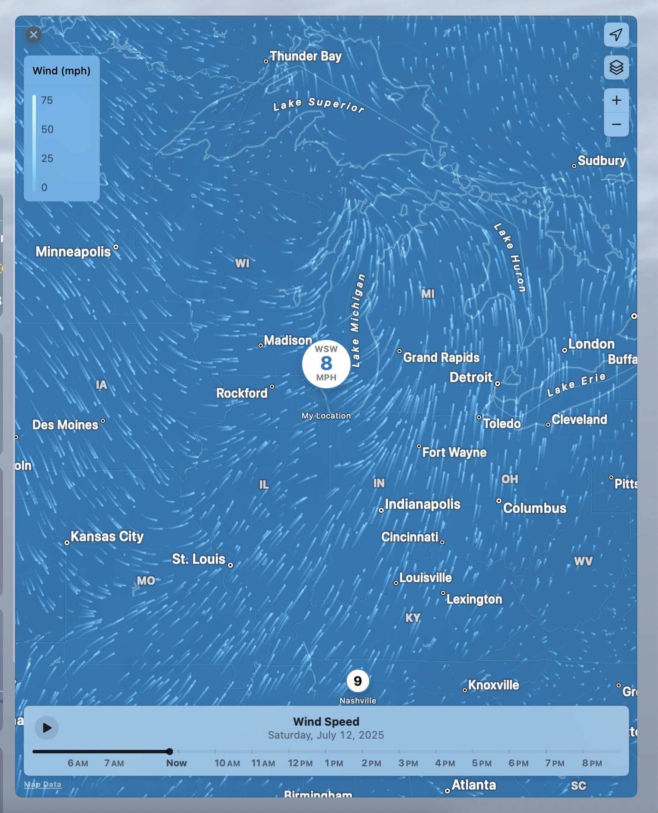
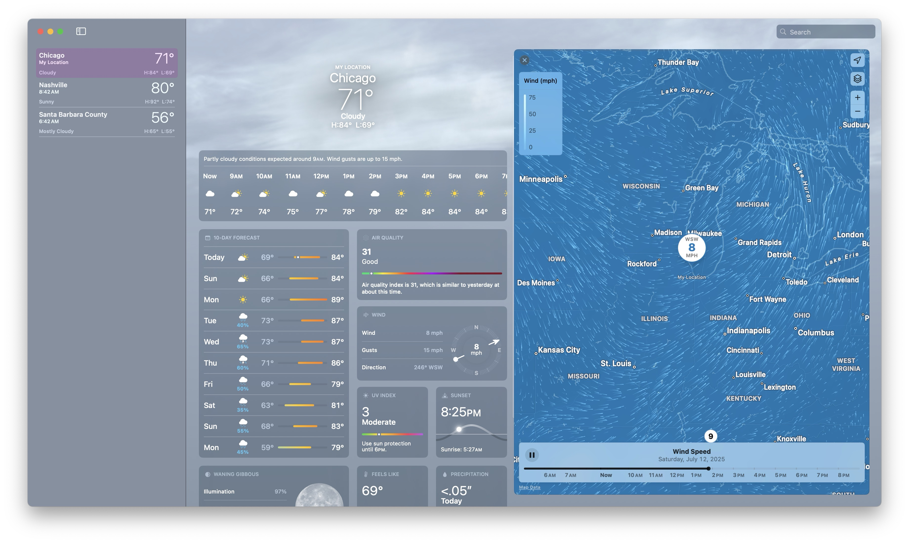

# wind-map
wind-map-animation


wind map animation repo

https://github.com/timxor/wind-map-animation


chatgpt
https://chatgpt.com/share/6872604f-ed1c-8002-8405-c8e3bc4e1934


apple wind map weather app

map data list
https://gspe21-ssl.ls.apple.com/html/attribution-303.html


### wind1.jpg





### wind2.jpg





## quick start


```
npm install
npm run dev
```


```
Then open http://localhost:5173 in Chrome.
```

http://localhost:5173


wind-map/
├─ index.html             ← your HTML (with <canvas>)
├─ src/
│  ├─ main.ts             ← loads & runs the animation
│  └─ wind.ts             ← particle logic (you already have this)
├─ vite.config.ts         ← Vite config (auto generated)
├─ tsconfig.json
└─ package.json
